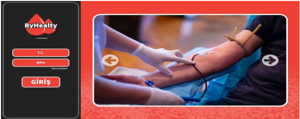
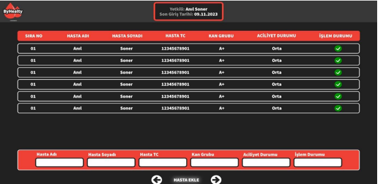

# 🩸 Kan Bağışı Takip Uygulaması

Bu proje, kan bağışı süreçlerini dijitalleştirmek ve hem hastane tarafında hem de bağışçı tarafında bilgi akışını kolaylaştırmak amacıyla geliştirilmiş bir masaüstü uygulamadır. Uygulama, .NET MAUI teknolojisi kullanılarak geliştirilmiş ve SQL Server veritabanı ile entegre edilmiştir.

---

## 🚀 Proje Özeti

Projede iki ayrı uygulama arayüzü bulunmaktadır:

- **👨‍⚕️ Hastane Paneli**
- **🧑‍🦰 Kullanıcı (Bağışçı) Paneli**

Bu iki panel, ortak bir RESTful API üzerinden birbirleriyle veri alışverişi yapmaktadır.

---

## 🛠️ Kullanılan Teknolojiler

| Katman       | Teknoloji                |
|--------------|--------------------------|
| UI           | .NET MAUI                |
| Backend API  | ASP.NET Core Web API     |
| Veritabanı   | Microsoft SQL Server     |
| ORM          | Entity Framework Core    |

---

## 📱 Uygulama Özellikleri

### 👨‍⚕️ Hastane Paneli:
- Kullanıcı (bağışçı) bilgilerini listeleme
- Yeni kullanıcı kaydı oluşturma
- Kan bağışı kayıtlarının girilmesi
- Kullanıcının bir sonraki bağış yapabileceği tarihi hesaplama

### 🧑‍🦰 Kullanıcı Paneli:
- Kendi bilgilerini görüntüleme
- Aynı kan grubuna sahip kullanıcıları listeleme
- Bir sonraki bağış yapılabilecek tarihi görme
- Kullanıcı dostu sade arayüz

---

## 🔌 API Entegrasyonu

Uygulama, tüm veri işlemlerini bir **ASP.NET Core Web API** aracılığıyla gerçekleştirir. API ile yapılan başlıca işlemler:

- Kullanıcı CRUD işlemleri
- Kan bağışı tarihinin güncellenmesi
- Kan grubu bazlı filtreleme
- Bir sonraki bağış tarihinin hesaplanması (örnek olarak: son bağıştan 56 gün sonrası)

---

## 📷 Ekran Görüntüleri

> 📌 

